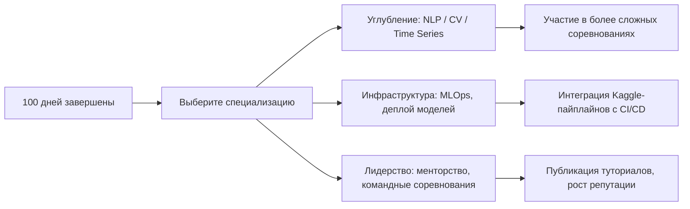

# 🗓️ 100-дневный план освоения Kaggle
## При бюджете 15–20 минут в день

> **Принцип плана**: микро-шаги, фокус на качестве, а не количестве, и постепенное накопление портфолио. План адаптирован под ваш бэкграунд в архитектуре и DevOps.

---

## 🔷 Общая структура

| Фаза | Дни | Фокус | Результат |
|------|-----|-------|-----------|
| **🟢 Онбординг** | 1–14 | Знакомство с платформой, настройка среды | Аккаунт, первый запуск Notebook |
| **🔵 База навыков** | 15–42 | Python/Pandas, визуализация, базовый ML | 3–5 учебных ноутбуков |
| **🟡 Практика** | 43–70 | Участие в соревновании для новичков, feature engineering | Первый сабмит, понимание пайплайна |
| **🔴 Портфолио** | 71–100 | Оформление проектов, публикация, нетворкинг | 2–3 публичных проекта, готовое резюме-кейс |

---

## 🔷 Фаза 1: Онбординг (Дни 1–14)

**Цель**: комфортно чувствовать интерфейс и запустить первый код.

| День | Задача (15–20 мин) |
|------|-------------------|
| 1 | Регистрация, заполнение профиля (укажите навыки: .NET, SQL, DevOps) |
| 2 | Обзор разделов: Datasets, Notebooks, Competitions, Learn |
| 3 | Пройти микро-курс [Python](https://www.kaggle.com/learn/python) — урок 1 |
| 4 | Курс Python — урок 2 + выполнить упражнение |
| 5 | Курс Python — урок 3 + сохранить код в черновик |
| 6 | Изучить 2–3 популярных датасета по тегу "beginner" |
| 7 | Форкнуть чужой простой Notebook (например, Titanic), запустить ячейки |
| 8 | Курс [Pandas](https://www.kaggle.com/learn/pandas) — урок 1 |
| 9 | Курс Pandas — урок 2, поэкспериментировать с загрузкой данных |
| 10 | Курс Pandas — урок 3, попробовать фильтрацию и группировку |
| 11 | Изучить раздел Models: посмотреть 2–3 предобученные модели |
| 12 | Настроить локальный доступ к Kaggle API (опционально, для автоматизации) |
| 13 | Прочитать 2–3 обсуждения в форуме соревнования Titanic |
| 14 | **Мини-итог**: записать 3 инсайта, что понравилось/не понятно |

> 💡 **Совет**: Используйте время в транспорте или обеденный перерыв. Не стремитесь «пройти всё» — лучше глубоко понять один концепт.

---

## 🔷 Фаза 2: База навыков (Дни 15–42)

**Цель**: сформировать устойчивые навыки работы с данными и простыми моделями.

### Недели 3–4: Data Exploration
| День | Задача |
|------|--------|
| 15–17 | Курс [Data Visualization](https://www.kaggle.com/learn/data-visualization) — уроки 1–3 |
| 18–19 | Взять датасет «House Prices», построить 3 графика (распределение, корреляция, выбросы) |
| 20 | Сохранить как черновик «EDA_HousePrices_v1» |
| 21 | **Повтор**: перечитать свой код, добавить комментарии |
| 22–24 | Курс [Intro to Machine Learning](https://www.kaggle.com/learn/intro-to-machine-learning) — уроки 1–3 |
| 25–26 | Построить базовую модель (RandomForest) на House Prices, оценить MAE |
| 27 | Сравнить 2 алгоритма (Linear Regression vs RF), записать выводы |
| 28 | **Мини-итог**: оформить блокнот с заголовками и маркдауном |

### Недели 5–6: Углубление и автоматизация
| День | Задача |
|------|--------|
| 29–31 | Курс [Feature Engineering](https://www.kaggle.com/learn/feature-engineering) — уроки 1–2 |
| 32–33 | Добавить 2–3 новых фичи в House Prices, проверить прирост качества |
| 34 | Изучить кросс-валидацию в sklearn, применить к своей модели |
| 35 | **Повтор**: рефакторинг кода — вынести функции, добавить docstring |
| 36–38 | Курс [Intermediate ML](https://www.kaggle.com/learn/intermediate-machine-learning) — уроки 1–2 |
| 39–40 | Поэкспериментировать с пайплайнами (Pipeline) для предобработки |
| 41 | Сохранить финальную версию блокнота как «HousePrices_Baseline_v1» |
| 42 | **Итог фазы**: опубликовать блокнот как «Draft» (не публично), получить фидбек от себя 😊 |

> 💡 **Для вашего бэкграунда**: обращайте внимание на воспроизводимость кода, логирование экспериментов, структуру проекта — это перекликается с DevOps-практиками.

---

## 🔷 Фаза 3: Практика на соревновании (Дни 43–70)

**Цель**: пройти полный цикл решения задачи: от данных до сабмита.

### Выбор соревнования:
✅ **Titanic** или **House Prices** (Getting Started, без дедлайнов, есть туториалы)

| День | Задача |
|------|--------|
| 43–44 | Прочитать описание соревнования, правила, метрику (Accuracy / RMSE) |
| 45–46 | Скачать данные, повторить быстрый EDA (5–7 строк кода на каждый инсайт) |
| 47–49 | Подготовить пайплайн предобработки: обработка пропусков, кодирование категориальных признаков |
| 50–52 | Обучить 3 базовые модели, сравнить по кросс-валидации |
| 53 | Выбрать лучшую, сделать прогноз на test.csv |
| 54 | Оформить submission.csv, отправить на лидерборд |
| 55 | **Зафиксировать результат**: скриншот позиции, значение метрики |
| 56–60 | Изучить 2–3 топ-решения из Discussion: какие фичи, ансамбли, трюки |
| 61–63 | Попробовать одну идею из топ-решений (например, целевое кодирование) |
| 64–66 | Улучшить пайплайн, сделать повторный сабмит |
| 67–69 | Добавить в блокнот раздел «Lessons Learned»: что сработало, что нет |
| 70 | **Итог фазы**: опубликовать блокнот как «Public» с понятным описанием |

> 💡 **Важно**: не гонитесь за топ-10. Цель — понять процесс, а не победить. Даже 50–100 место — это отличный результат для первого раза.

---

## 🔷 Фаза 4: Портфолио и нетворкинг (Дни 71–100)

**Цель**: превратить учебные наработки в актив для карьеры.

### Недели 11–12: Оформление проектов
| День | Задача |
|------|--------|
| 71–73 | Выбрать 2 лучших блокнота, добавить: заголовок, описание, выводы, визуализации |
| 74–76 | Добавить README-секцию: задача, подход, метрики, как воспроизвести |
| 77–79 | Проверить код на читаемость: имена переменных, комментарии, удаление лишних ячеек |
| 80 | Опубликовать оба блокнота как «Public» |

### Недели 13–14: Интеграция с профилем
| День | Задача |
|------|--------|
| 81–83 | Обновить профиль Kaggle: фото, био, ссылки на LinkedIn/GitHub |
| 84–86 | Добавить проекты в раздел «Featured» на профиле |
| 87–89 | Написать короткий пост в Discussion: «Мой путь в первом соревновании» (можно на русском) |
| 90 | **Мини-итог**: проверить, как профиль выглядит со стороны |

### Недели 15–16: Масштабирование и рефлексия
| День | Задача |
|------|--------|
| 91–93 | Изучить один продвинутый датасет (например, NLP или временные ряды) — просто посмотреть структуру |
| 94–96 | Поэкспериментировать с Kaggle Models: загрузить предобученную модель, сделать инференс |
| 97–99 | Составить список «Следующие шаги»: какие курсы/соревнования интересны дальше |
| 100 | **Финальный ритуал**: экспортировать 2 лучших проекта в PDF/GitHub, обновить резюме с упоминанием Kaggle-опыта |

> 💡 **Для архитектора/техлида**: в описании проектов делайте акцент на:
> - масштабируемость пайплайна
> - воспроизводимость экспериментов
> - выбор метрик с точки зрения бизнеса
> Это выделит вас среди кандидатов, которые просто «запустили модель».

---

## 🔷 Чек-лист успеха на 100 дней

✅ Аккаунт на Kaggle с заполненным профилем  
✅ 3–5 публичных блокнотов с чистым кодом и комментариями  
✅ Участие в ≥1 соревновании с сабмитом и фиксацией результата  
✅ Понимание полного цикла: данные → модель → оценка → интерпретация  
✅ Обновлённое резюме с кейсами и ссылками на работы  
✅ План дальнейшего развития (например, углубление в NLP или MLOps)

---

## 🔷 Лайфхаки для 15-минутных сессий

🔹 **Готовьте задачу заранее**: вечером напишите, что будете делать завтра (например, «построить гистограмму цены»)  
🔹 **Используйте мобильное приложение Kaggle**: можно читать обсуждения, изучать датасеты в пути  
🔹 **Копируйте-вставляйте**: не пишите код с нуля — форкайте и модифицируйте  
🔹 **Фиксируйте прогресс**: ведите простой лог в Notion/Excel: «День 27: добавил фичу X, MAE улучшился на 2%»  
🔹 **Не пропускайте дни**: лучше 10 минут, чем 0. Консистентность важнее длительности

---

## 🔷 Что дальше после 100 дней?

> 🎯 **Главный вывод**: за 100 дней по 20 минут вы не станете грандмастером, но создадите **устойчивую привычку**, **рабочее портфолио** и **понимание индустриального цикла Data Science**. Для позиции senior/architect это именно то, что нужно: не просто знания, а доказанная способность учиться и применять.

Удачи в пути! 🚀 Если захотите — могу помочь адаптировать план под конкретную цель (например, подготовка к собеседованию на ML Architect).
